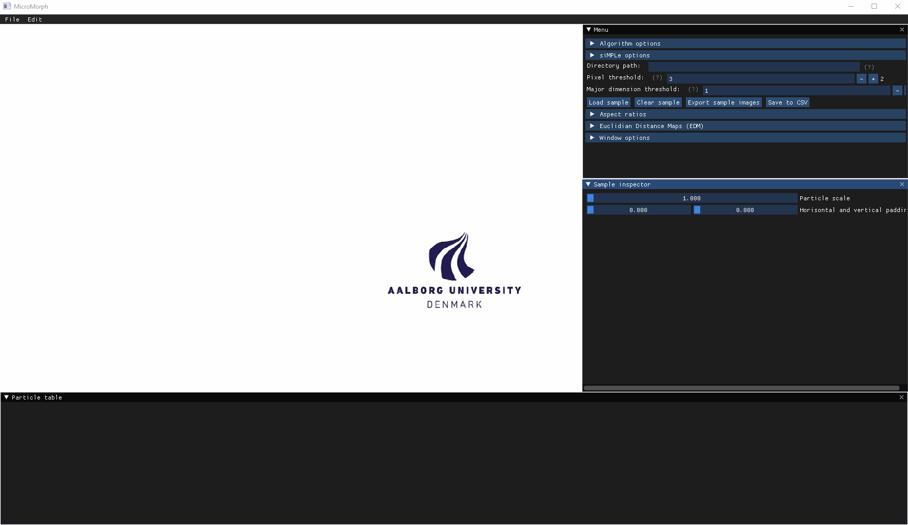

# MicroMorph

MicroMorph: The Microplastic Shape and Size Analyzer

## Fibers and Numbers (FAN)

FAN calculates the shape morphology and size of objects from the particle map provided by sIMPle (https://simple-plastics.eu/). It provides a graphical interface to inspect particles and their respective shape characteristics. The program calculates the following size and shape descriptors:

Size:
* Area, perimeter, minor dimension, major dimension, perimeter, and maximum and minimum Feret diameter

Shape:
* Convexity, convex area, solidity, equivalent circle diameter, circularity, compactness, aspect ratio, Feret ratio, fiber length, fiber curl, average fiber diameter, fiber elongation

FAN is written in C-idiomatic style C++ code with little use of C++ features (pretty much just std::vector). The binary is statically linked and the only dependencies are the Microsoft runtime distributables and OpenGL libraries.

## Usage

Run FAN.exe. An unfinished documentation is avaialble in the "documentation.odf" with an explanation of the most critical features. 

## Algorithms

FAN includes a number of algorithms to calculate the size and shape of Microplastic particles, including:

* Contour tracer
* Particle filling
* Convex hull
* Feret's diameter
* Zhang-suen thinning
* Skeletonazition
* Breadth-first search, and more. 

The most interesting algorithms are explained below. 

### Contour tracing

First, it transverses through the array row wise and assigns the first pixel it encounters as the starting pixel of the boundary (b). Then the algorithm travels through the array in the Moore Neighbourhood until the starting pixel is reached again, see Fig. 1. The algorithm ONLY works for closed boundaries!

Algorithm:
1. Find the first non-zero pixel travelling row wise.
2. Set that index as the starting point as S.
3. Set the current index as p and add this to the boundary pixel list.
4. Set the previous index visited from p as b (backtraced pixel).
5. Go through the Moore Neighbourhood (3 * 3 pixels around p) starting from b and look for the first non-zero pixel in a clockwise rotation around p.
6. Repeat steps 3 to 5 until p is equal to S.

<figcaption align = "center">Figure 1: How the algorithm transverses through the particle pixel map and the resulting pixel boundary.</figcaption>

### Fiber Length

Fiber length is calculated by the following approach:

1. Find the skeleton of the object (Figure 2 B).
2. Find pixels in the skeleton with only one non-zero neighbour skeleton pixel (Fiure 2 C). Define them as endpoints.
3. Find the shortest distance between all endpoints and select the longest of the shortest paths (Figure 2 D).

The skeleton is calculated using the Zhang-suen thinning algorithm. Endpoints are found by visiting each skeleton pixel and find the pixels with only one neighbour skeleton pixel. The shortest distance between each endpoint is found by the breath first search algorithm. The longest path is found by comparing each of the shortest paths between endpoints and selecting the longest. Hence, the fiber length is the longest shortest path between endpoints.

<figcaption align = "center">Figure 2: A: Particle before skeletonization. B: Morphological skeletonization of A. Notice multiple branches departing from the main skeleton. C: Endpoints of the skeleton. D: Longest path in skeleton between two endpoints. The yellow line in D is defined as the fiber length.</figcaption>

